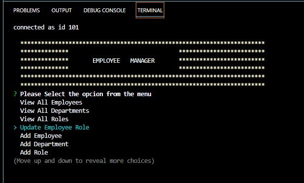
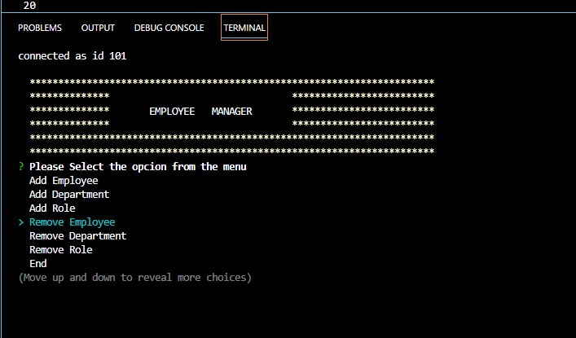
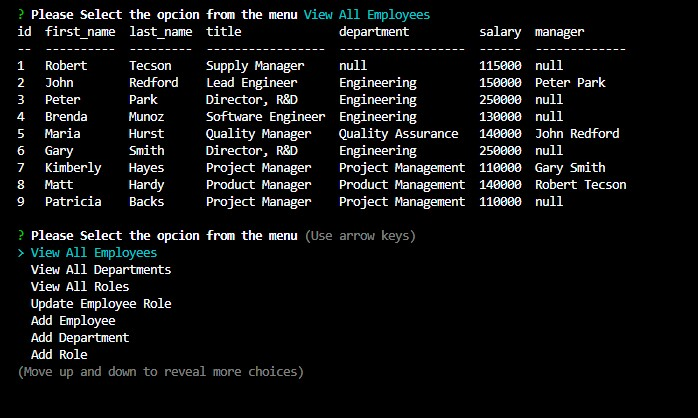
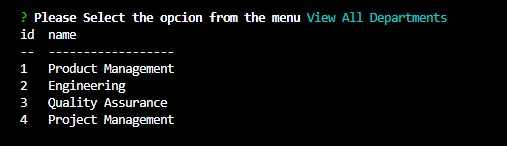
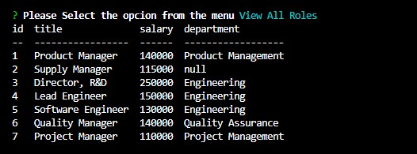
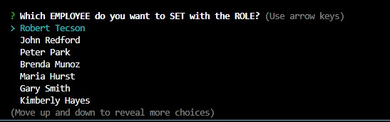
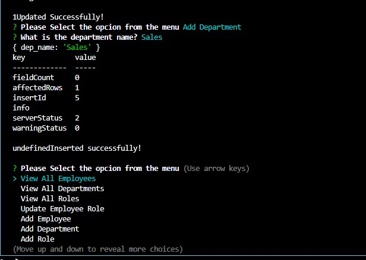
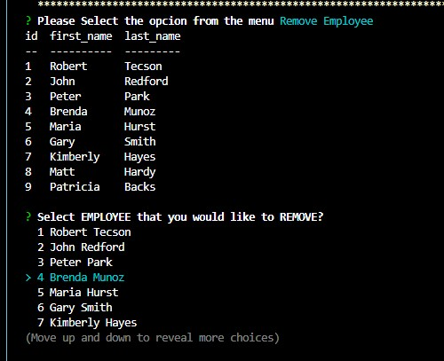

# MAUGB-M12C-SQL-Employee-Tracker
Manage employee database using a Interface content management system, Node.Js, Inquirer, MySQL

## Description

This application uses MySQL to help to manage a company’s employee database.

Application also uses Node.js, Inquirer.

Application creates a database and tables of employe data, department, role .

Data is stored on the database and the user can view department, role, employee’s data. Add Employee, Department and Role or remove Employee, Department and Role. 
This application works on the back-end.

Create an application that allows the user to create a database, manage employee information, departments and roles. 
The application mainly uses MySQL and Inquirer to get user’s input.
On the back end is using NodeJS and server routing for application.

Users can organize easily and manage employee information for all the company updates, save and delete.  It allows the user to manage large amounts of data increasing over time updating accurately the records for each employee, salary role and department.

This program shows the use of NodeJS as backend JavaScript to be able to execute the JavaScript code and use of MySQL to create and manage information from database and corresponding tables. 
Connection to the application, use schema.sql and seeds.sql for database creation, tables and data.

I learned the use of MySQL , Inquire and  NodeJS to write the server file using JavaScript.
Use of schema to create the tables for department, role and employe. Use of primary keys.
Create a back-end application, set-up a server, MySQL  and server route for Application. 
Manage use input thru inquirer.

## Table of Contents

- [Installation](#installation)
- [Usage](#usage)
- [Credits](#credits)
- [License](#license)

## Installation

This Program can run using on the local terminal host location (local port).

- This program runs under Node.js and MySQL.  
- Clone the repository.
- Repository location: https://github.com/MauricioGB1/MAUGB-M12C-SQL-Employee-Tracker
- Proceed to clone this repository.  Open in integrated terminal and then run : node index.js
- Install npm install inquire and MySQL2.
- You can run the server.js file from the integrated terminal. By typing node server.js.

## Usage

Run npm install 
Use the file server.js 
Run node server to start the application; application will run locally on the indicated port.

DEMO VIDEO  Link:
https://github.com/MauricioGB1/MAUGB-M12C-SQL-Employee-Tracker/tree/main/video

How to Use the application 
Provide instructions and examples for use. Include screenshots as needed.

Start SQL Employee Tracker Application 

Main Application

Options Menu

Table with All Employees

Table with All Departments

Table with All Roles

Changing Employee Role

Adding a New Department 

Removing an  Employee

## Credits

-	Generate license badge: https://shields.io/ .  
-   Use of NodeJS   16.16.0
-   Use of JavaScript
-   Use of Console.table": "^0.10.0",
-   Use of inquirer 8.2.0
-   Use of mysql2 2.3.3

## License

This program runs under the MIT license.
    MIT
    
  

## Features

- User input collection using Inquire
- Selection of option using arrow keys up or down
- Application running on backend on localhost.
- Data for each from employee is typed and saved into database file
- Data for Department or Roles can be updated, created or deleted.
- Routers created for communication between application and database on back-end.

## How to Contribute

If you would like to contribute please send an e-mail to gomezb_mauricio@hotmail.com. Please share your GitHub repository name and your message.

